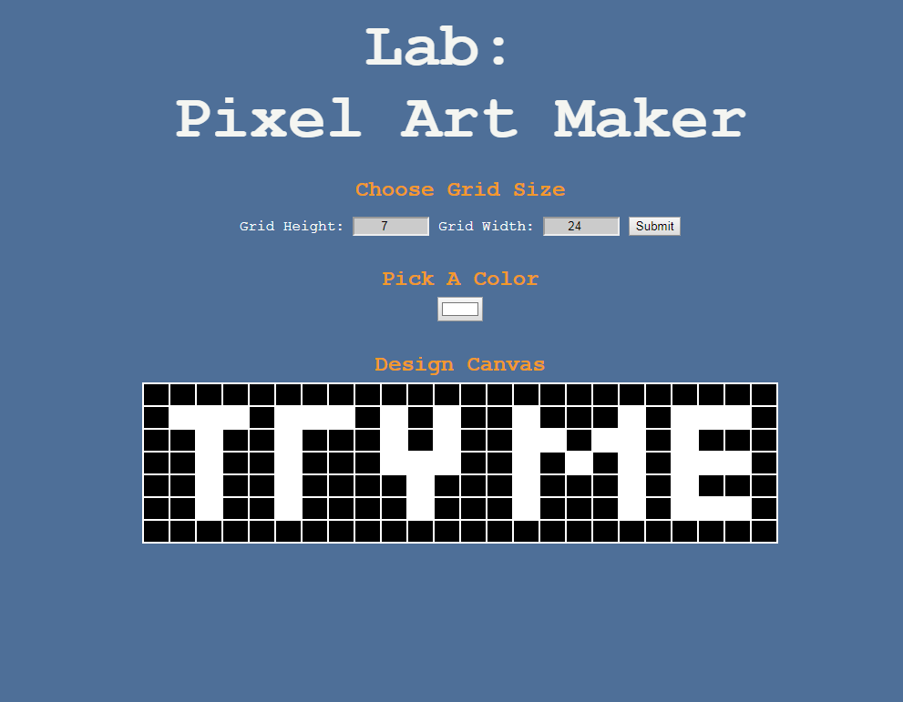

# Lab: Pixel Art Maker #

This project was completed by me through Udacity.  I'm currently enrolled in the Front-End Web Developer Nanodegree program, and I had to complete this project as part of my course.

## Screenshot ##

## How to use? ##

* Select a number >= 1 for the Grid Height 
* Select a number >= 1 for the Grid Width
    * click Submit (this will create your grid)

* click on the color box under 'Pick A Color'
    *Select the color you would like to convert the cells to.

* left click a cell block to change that cell to the color you have selected!

Warning - Pressing submit after you make alter cell color will reset the grid to the default color.

## Test it out! ##
